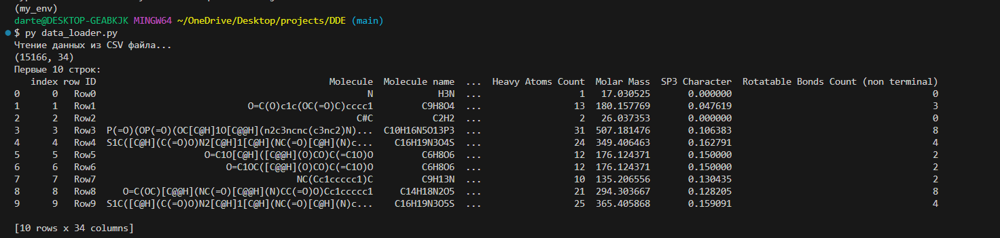

# DDE
*Ссылка на датасет:*
https://drive.google.com/file/d/1lIOnHOtzCNSoXV8akytUimq2RfNTC7PU/view?usp=sharing

## **Чтение датасета**

Создание окружение conda
```bash
conda create -n my_env python pip
```
Активация окружения 
```bash
conda activate my_env
```
Установка poetry
```bash
pip install poetry
```
Создание файла зависимостей в папке пректа
```bash
poetry init
```
Добавление нужных библиотек
```bash
poetry add jupiterlab pandas matplotlib wget
```
Установка зависимостей 
```bash
poetry install --no-root
```
Запуск скрипта для чтения датасета 
```bash
py data_loader.py
```
## **Вывод первых 10 строк**


## **Exploratory Data Analysis (EDA)** 
Анализ датасета химических дескрипторов

Цели анализа:
- изучить структуру данных
- проверить их полноту и целостность 
- оценить выбросы

## **ETL**
Структура
etl/
├── extract.py  # Извлечение, оценка и сохранение сырых данных в .cvs
├── transform.py  # Проверка и приведение типов данных, сохранение очищенных данных в .parquet
├── load.py  # Выгрузка 100 строк данных из .parquet в базу данных homeworks
└── main.py  # Cбор файлов вместе и предоставление CLI-интерфейса

Запуск полного процесса etl
``` bash
python etl/main.py all
```
Запуск файлов по отдельности
``` bash
python etl/main.py extract
python etl/main.py transform
python etl/main.py load
```
