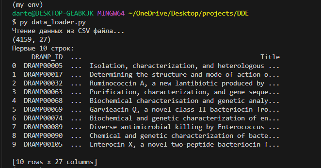

# DDE
*Ссылка на датасет:*
https://docs.google.com/spreadsheets/d/1MlAv7zskm-DREw68_BXRft9_WRcHqe1b/edit?usp=drive_link&ouid=117653001690642948364&rtpof=true&sd=true

*Ссылка на источник данных:*
http://dramp.cpu-bioinfor.org/downloads/

## **ЧТЕНИЕ ДАТАСЕТА**

Создание окружение conda
```bash
conda create -n my_env python pip
```
Активация окружения 
```bash
conda activate my_env
```
Установка poetry
```bash
pip install poetry
```
Создание файла зависимостей в папке пректа
```bash
poetry init
```
Добавление нужных библиотек
```bash
poetry add jupiterlab pandas matplotlib wget
```
Установка зависимостей 
```bash
poetry install --no-root
```
Запуск скрипта для чтения датасета 
```bash
py data_loader.py
```
## **Вывод первых 10 строк**

